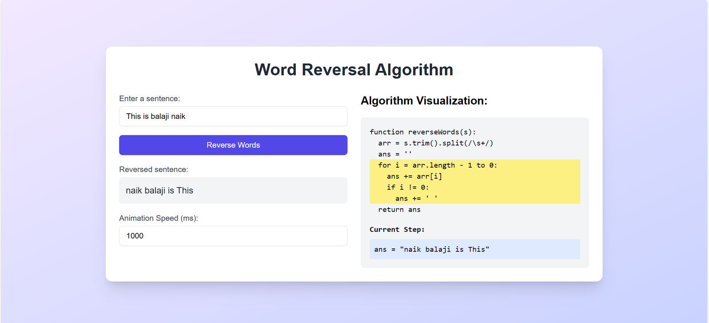

# Word Reversal Algorithm with Visualization

This project is a simple web application that demonstrates a word reversal algorithm. It includes a visualization of the algorithm's steps, showing the reverse process of a given sentence in real-time. The project is built using React and JavaScript, and allows users to interactively see how the words in a sentence are reversed.

## Table of Contents
- [Demo](#demo)
- [Features](#features)
- [Technologies](#technologies)
- [Setup](#setup)
- [How to Use](#how-to-use)
- [Pseudocode](#pseudocode)
- [License](#license)

## Demo



## Features

- Enter a sentence and reverse the words in the sentence.
- Algorithm visualization, showing each step of the reversal process.
- Adjustable animation speed to see how each step of the algorithm works.
- Real-time display of the algorithm's pseudocode alongside the output.

## Technologies

- **React**: Frontend framework for building the user interface.
- **JavaScript**: Used for the algorithm and application logic.
- **Tailwind CSS**: Styling framework for building responsive and modern UI.
- **Vercel**: (Optional) For deployment.

## Setup

To run this project locally, follow these steps:

1. Clone this repository:

   ```bash
   git clone https://github.com/yourusername/word-reversal-visualization.git
   cd word-reversal-visualization
